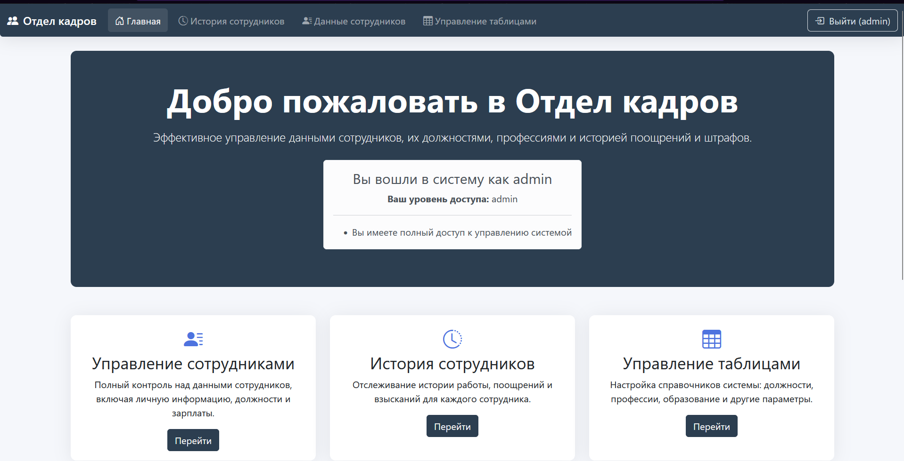
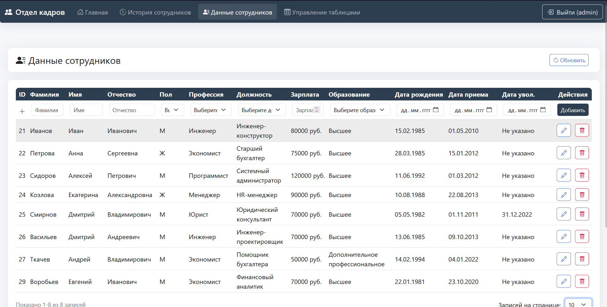

## Описание

Этот проект представляет собой веб-приложение для управления персоналом. В нем реализована система аутентификации пользователей с возможностью регистрации, входа и управления ролями.
Всего в проекте 4 основные страницы
1.Главная
Домашняя стрница на которой находится вся основная, вводная информация



2.История сотрудников
На данной странице находится история штрафов и поощрений работников 


3.Данные сотрудников
Это основная таблица приложения, на ней находится полная информация о работниках, дата рождения, пол, зарплата и т.д.



3.Управление таблицами
Это вспомогательня страница, которая нужна для внесения изменений в сужебные таблицы, информация из которых будет впоследствии отображаться в основной таблице на странице Данные сотрудников. 


## Система входа и регистрации

1.Роли
В приложении используется система ролей, а именно 3 роли каждая из которых со своим уровнем доступа к функциям системы:

Роль user - может только просматривать данные на странице  
Роль editor - может только редактировать уже существующие данные, но не может ничего удалять и добавлять
Роль admin - имеет полные права, может удалять, добавлять и ризменять лубые данные в таблицах

2.Аккаунты
В базе данных по умолчанию существуют три демонстрационных аккаунта:

Логин: admin
Роль: admin
Пароль: admin123

Логин: user
Роль: user
Пароль: user123

Логин: editor
Роль: editor
Пароль: editor123

3.Регистрция
Также пользователь может создать свой аккаунт, для этого нужно ввести логин, пароль и желаемый уровень доступа, то есть роль. При выборе роли Редактор или Админ система запросит служебный пароль, так как подразумевается что пользователь, который может создать аккаунт с данными ролями это работник компании.

Служебный пароль админа: adminsecret
Служебный пароль редактора: editorsecret

## Структура проекта

Backend:
- `server.js`: Точка входа приложения, подключает модули маршрутов и обработчик ошибок.
- `src/config/db.js`: Подключение к базе данных (конфигурация через переменные окружения).
- `src/middleware/auth.js`: JWT-аутентификация (`authenticateToken`, `signToken`).
- `src/routes/`:
  - `auth.js`: Авторизация, регистрация, защищённый маршрут.
  - `workers.js`: CRUD для работников (с JOIN справочников).
  - `list.js`: CRUD для истории действий.
  - `positions.js`, `professions.js`, `education.js`: CRUD для справочников.
  - `genders.js`, `actions.js`: чтение справочников.
  - `stats.js`: агрегированные счётчики.

Frontend:
- `public/`: HTML/CSS/JS (статические файлы).
  - `home.html`, `index.html`, `list.html`, `tables.html`, `login.html`, `register.html`, `css/styles.css`.
- `ok.sql`: SQL-скрипт для инициализации БД.

## Установка и запуск

1. Убедитесь, что у вас установлен Node.js.
2. Создайте файл `.env` (опционально):
   ```env
   PORT=3000
   DB_HOST=localhost
   DB_USER=root
   DB_PASSWORD=root
   DB_NAME=ok
   DB_PORT=3306
   JWT_SECRET=change_me
   ```
3. Установите зависимости:
   ```bash
   npm install
   ```
4. Запустите сервер:
   ```bash
   node server.js
   ```
   или для разработки с перезапуском:
   ```bash
   npm run dev
   ```

## Лицензия

Этот проект распространяется под лицензией MIT.
